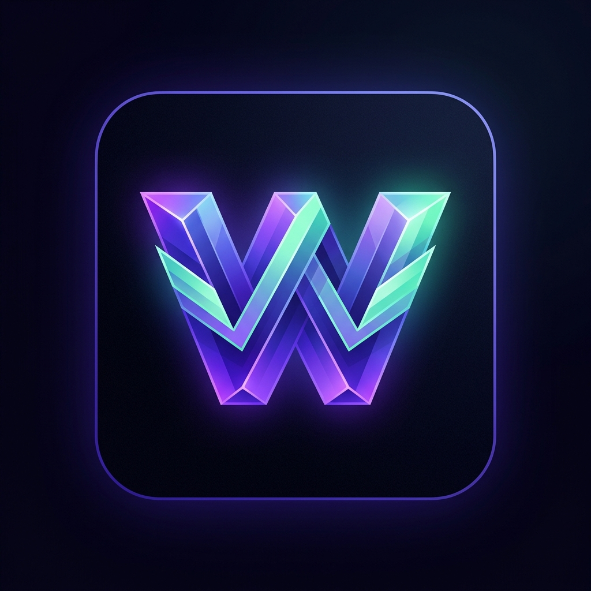
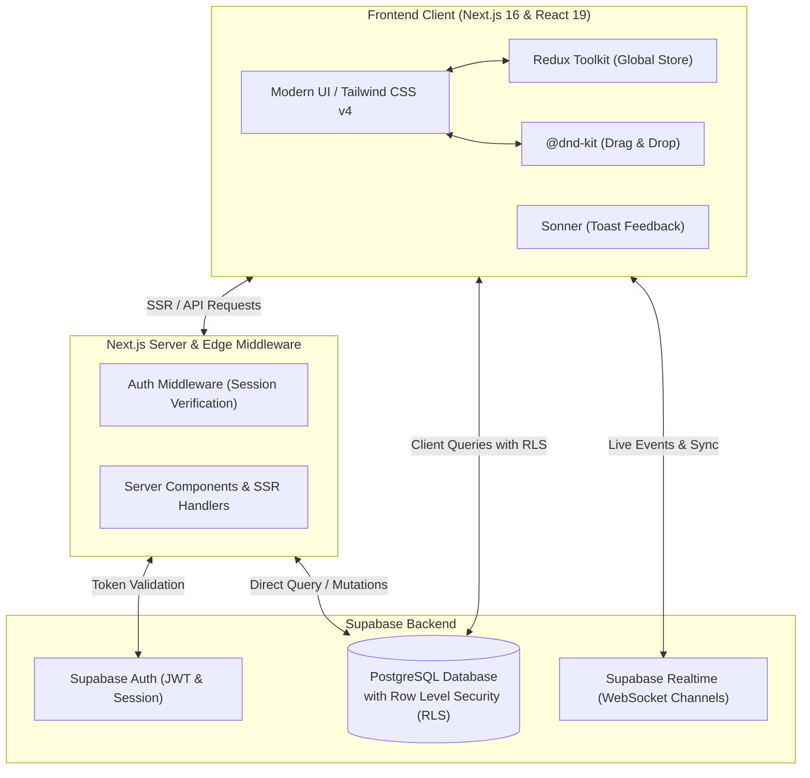

<div align="center">

  

  # ⚡ Wasif's Workspace
  
  **The Next-Generation Multi-Workspace Project Management & Real-Time Collaboration Platform**

  [](https://nextjs.org/)
  [](https://react.dev/)
  [](https://www.typescriptlang.org/)
  [](https://tailwindcss.com/)
  [](https://supabase.com/)
  [](https://redux-toolkit.js.org/)
  [](LICENSE)

  <p align="center">
    <a href="#-features">Features</a> •
    <a href="#-architecture">Architecture</a> •
    <a href="#-quick-start">Quick Start</a> •
    <a href="#-database-schema">Database & Security</a> •
    <a href="#-project-structure">Project Structure</a> •
    <a href="#-contributing">Contributing</a>
  </p>

</div>

---

## 🌟 Overview

**Wasif's Workspace** is an enterprise-grade project management platform engineered for high-velocity software engineering, design, and operations teams. Built from the ground up with **Next.js 16 (App Router)**, **React 19**, **Tailwind CSS v4**, and **Supabase**, it delivers frictionless task tracking, live multi-user synchronization, and workspace switching in a sleek dark-mode interface.

---

## ✨ Core Features

<table>
  <tr>
    <td width="50%">
      <h3>🏢 Universal Workspace Switcher</h3>
      <p>Seamlessly switch between multiple workspaces, organizations, and projects without losing your context or state.</p>
    </td>
    <td width="50%">
      <h3>📋 Interactive Kanban Board</h3>
      <p>Smooth drag-and-drop task workflows powered by <code>@dnd-kit</code> with swimlanes, priority indicators, and member assignments.</p>
    </td>
  </tr>
  <tr>
    <td width="50%">
      <h3>📝 Multi-View Project Modes</h3>
      <p>Toggle instantly between <b>Kanban Board</b>, <b>Structured List</b>, and <b>Calendar View</b> to visualize sprints your way.</p>
    </td>
    <td width="50%">
      <h3>⚡ Real-Time Live Sync</h3>
      <p>Instant collaboration backed by <b>Supabase Realtime WebSockets</b> — see task movements and status updates across devices as they happen.</p>
    </td>
  </tr>
  <tr>
    <td width="50%">
      <h3>🎯 "My Tasks" Focus Engine</h3>
      <p>A unified personal task aggregator gathering assignments across all projects into a single high-priority dashboard.</p>
    </td>
    <td width="50%">
      <h3>📊 Analytics & Admin Hub</h3>
      <p>Track team velocity, milestone progress, completed deliverables, and manage workspace members with fine-grained roles.</p>
    </td>
  </tr>
  <tr>
    <td width="50%">
      <h3>🛡️ Enterprise Security & RLS</h3>
      <p>Robust Row-Level Security (RLS) in PostgreSQL ensuring strict multi-tenant isolation and workspace permission integrity.</p>
    </td>
    <td width="50%">
      <h3>🎨 Modern Dark Aesthetics</h3>
      <p>A curated dark-mode design system with glowing navigation progress indicators, micro-animations, glassmorphism, and responsive layouts.</p>
    </td>
  </tr>
</table>

---

## 🏗️ Architecture

The system is designed with a modern decoupled full-stack architecture combining server-side rendering, client state management, and real-time database reactivity:



---

## 🚀 Quick Start

### 1. Prerequisites

Ensure you have the following installed:
- [Node.js](https://nodejs.org/) (v18.18+ or v20+ recommended)
- [npm](https://www.npmjs.com/), [pnpm](https://pnpm.io/), or [bun](https://bun.sh/)
- A free [Supabase](https://supabase.com/) account and project

### 2. Clone the Repository

```bash
git clone https://github.com/wasifalidev/Workspace-Hackathon.git
cd Workspace-Hackathon
```

### 3. Install Dependencies

```bash
npm install
```

### 4. Configure Environment Variables

Duplicate `.env.example` into `.env.local`:

```bash
cp .env.example .env.local
```

Fill in your Supabase credentials:

```env
# Supabase Configuration
NEXT_PUBLIC_SUPABASE_URL=https://your-project-id.supabase.co
NEXT_PUBLIC_SUPABASE_ANON_KEY=your-anon-key-here
```

> [!NOTE]
> You can retrieve these credentials in your **Supabase Dashboard** under **Project Settings > API**. Never expose the `service_role` key in client environment variables.

### 5. Initialize the Database Schema

Run the SQL migration scripts located in the `sql/` directory in your Supabase SQL Editor:

1. Execute [`sql/000_full_schema.sql`](sql/000_full_schema.sql) (or run the individual numbered migration files from `001` to `020`).
2. Verify that tables (`workspaces`, `projects`, `tasks`, `profiles`, etc.) and RLS policies are created successfully.

### 6. Launch the Development Server

```bash
npm run dev
```

Open [http://localhost:3000](http://localhost:3000) in your browser to start exploring!

---

## 📂 Project Structure

```text
Wasif's Workspace/
├── 📁 app/                     # Next.js 16 App Router pages and layouts
│   ├── 📁 (app)/               # Authenticated application shell
│   │   ├── 📁 [workspace]/     # Workspace routes ([project], tasks, board, etc.)
│   │   │   └── 📁 [project]/   # Project views: board, list, calendar
│   │   ├── 📁 admin/           # Administrative controls & analytics
│   │   ├── 📁 dashboard/       # Main workspace dashboard
│   │   ├── 📁 my-tasks/        # Consolidated personal tasks
│   │   ├── 📁 notifications/   # Activity alerts & notification feed
│   │   ├── 📁 settings/        # User & workspace settings
│   │   └── 📁 workspaces/      # Workspace directory & management
│   ├── 📁 (auth)/              # Authentication screens (login, register)
│   ├── 📁 auth/                # Auth callback handlers
│   ├── 📄 layout.tsx           # Root layout with top progress bar & font setup
│   └── 📄 page.tsx             # Landing hero & feature showcase
├── 📁 components/              # Modular, reusable UI component library
│   ├── 📁 dashboard/           # Metrics cards, charts, and velocity widgets
│   ├── 📁 layout/              # Sidebar, Header, Breadcrumbs, Navigation
│   ├── 📁 providers/           # Redux, Auth, and Theme providers
│   ├── 📁 tasks/               # Kanban board, Task cards, Task modal dialogs
│   └── 📁 ui/                  # Buttons, Inputs, Badges, Modals, Logo
├── 📁 lib/                     # Utilities & external client configurations
│   ├── 📁 supabase/            # Browser, Server, and Middleware Supabase clients
│   └── 📁 utils/               # Formatting, date helpers, classnames
├── 📁 sql/                     # PostgreSQL migrations, RLS policies, & triggers
│   ├── 📄 000_full_schema.sql  # Complete schema migration
│   ├── 📄 015_rls_policies.sql # Multi-tenant security rules
│   └── 📄 016_functions_triggers.sql # Automated triggers & audit logs
├── 📁 store/                   # Redux Toolkit state slices & root store
├── 📁 public/                  # Static assets (brand logos, icons, favicon)
├── 📄 middleware.ts            # Route protection and Supabase session refresh
├── 📄 next.config.ts           # Next.js build and image optimization config
└── 📄 package.json             # Dependencies and build scripts
```

---

## 🗄️ Database & Security Architecture

The platform uses a relational PostgreSQL schema with **Row Level Security (RLS)** to enforce strict workspace isolation:

| Entity | Description | Key Features |
| :--- | :--- | :--- |
| **`profiles`** | User metadata & settings | Auto-synced with Supabase Auth |
| **`workspaces`** | Multi-tenant organization containers | Unique slugs, avatars, ownership |
| **`workspace_members`**| Role-based access control | `owner`, `admin`, `member`, `viewer` |
| **`projects`** | Workspace sub-initiatives | Status tracking, colors, deadlines |
| **`tasks`** | Actionable project tasks | Status swimlanes, priorities, assignees |
| **`subtasks`** | Granular task checklists | Checked status, ordering |
| **`activity_logs`** | Real-time audit timeline | Comprehensive action tracking |
| **`notifications`** | Mention and assignment alerts | Read status, actionable links |

---

## 🛠️ Tech Stack & Libraries

- **Framework**: [Next.js 16.3.4](https://nextjs.org/) with React Server Components & App Router
- **Runtime & UI**: [React 19.2.8](https://react.dev/)
- **Styling**: [Tailwind CSS v4](https://tailwindcss.com/) with custom dark design tokens
- **Database & Auth**: [Supabase](https://supabase.com/) (PostgreSQL + RLS + Realtime WebSocket)
- **State Management**: [Redux Toolkit](https://redux-toolkit.js.org/) + [React Redux](https://react-redux.js.org/)
- **Drag & Drop**: [@dnd-kit/core](https://dndkit.com/) & [@dnd-kit/sortable](https://dndkit.com/)
- **Notifications**: [Sonner](https://sonner.emilkowal.ski/)
- **Date Handling**: [date-fns](https://date-fns.org/)
- **Icons**: [Google Material Symbols](https://fonts.google.com/icons)

---

## 💻 Available Scripts

| Command | Action |
| :--- | :--- |
| `npm run dev` | Starts local Next.js development server at `http://localhost:3000` |
| `npm run build` | Compiles optimized production bundle |
| `npm run start` | Runs the compiled production server |
| `npm run lint` | Checks codebase for ESLint warnings and errors |

---

## 🤝 Contributing

Contributions, issues, and feature requests are welcome!

1. Fork the Project
2. Create your Feature Branch (`git checkout -b feature/AmazingFeature`)
3. Commit your Changes (`git commit -m 'feat: Add some AmazingFeature'`)
4. Push to the Branch (`git push origin feature/AmazingFeature`)
5. Open a Pull Request

---

## 👤 Author

**Wasif Ali**
- GitHub: [@wasifalidev](https://github.com/wasifalidev)
- Repository: [Workspace-Hackathon](https://github.com/wasifalidev/Workspace-Hackathon)
- Email: [mianwasifdev@gmail.com](mailto:mianwasifdev@gmail.com)

---

## 📄 License

This project is licensed under the MIT License — see the [LICENSE](LICENSE) file for details.

<div align="center">
  <sub>Built with ❤️ for productive teams by Wasif Ali.</sub>
</div>
